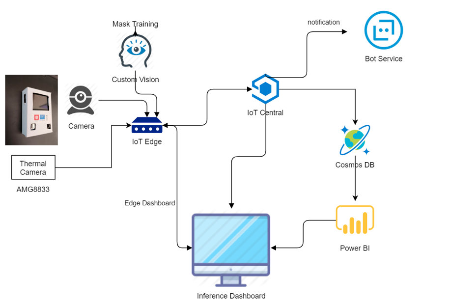

# Project-AICARE
Project AI CARE for thermal and face mask detection
# Demo Video : 
##	AI Care Edge Demo - https://youtu.be/Wh_21go4Thg
##	AI Care Device hands-on -  https://youtu.be/d4HqonLCNmM 
##	Mask Training by Custom Vision -  https://youtu.be/eEb9vfvgW0g 
##	Mask Inference Demo with Custom Vision on IoT Edge - https://youtu.be/dXDriffeE6Q 

1.  **AI CARE System Architecture** –

**System Overview**

1.  Mask Training –

    1.  Leverage Azure Custom Vision for mask training in 5 minutes !

    2.  Re-train your own dataset to improve your enterprise accuracy.

    3.  Deploy AI model as IoT Edge module for quick deployment & distribution.

2.  IoT Edge –

    1.  AI on Edge for inference performance and data consolidation.

    2.  Edge dashboard module for real-time result display.

    3.  Large Scale AI Module deployment efficiency.

3.  IoT Central –

    1.  Overall Coronavirus Epidemic prevention dashboard

    2.  Create Your Cross multi-region Summary in 5 mins

    3.  Control Sensor device settings and monitoring easily

    4.  Notification built-in and quick customization.

4.  BoT Service –

    1.  Connect to social media notification (Line/Facebook/SMS..etc)

    2.  Create your own logic for notification dispatching

5.  Power BI + CosmosDB –

    1.  Enterprise Dashboard for your deep customization UI requirement.

    2.  Develop your enterprise level dashboard based on IoT Central dataset

    3.  Quick widgets and drag&drop mode to mash up your complex UI and
        reporting.

6.  **Hands-On Guide Tutorial** -

-   **Device Side** –

    1.  M5StackCore –

        1.  Development & Pinout Reference –
            <https://docs.m5stack.com/#/en/quick_start/m5core/m5stack_core_get_started_Arduino_Windows>

        2.  Git clone from - <https://github.com/tommywu052/project-AICARE.git>

1.  Go to
    [project-AICARE](https://github.com/tommywu052/project-AICARE)/[device](https://github.com/tommywu052/project-AICARE/tree/master/device)/**M5Stack_Thermal**/,
    modify the code as below for your own wifi ssid / password and Azure IoT
    Central device connection string.

1.  Flash the modified .ino file into your m5stack core . make sure you have
    import the related library as m5stack core reference document as step 1.

1.  Port Connection map

1.  ESP32 CAM –

-   Development & Pinout Reference –
    <https://www.instructables.com/id/ESP-32-Camera-Streaming-Video-Over-WiFi-Getting-St/>

-   ESP32 CAM connect M5stack map –

1.  Battery –

    1.  External Battery Pinout map –

-   **Backend Side** –

    1.  Mask Training with Azure Custom Vision –

1.  Download Kiosk App : <http://aka.ms/kioskapp>

2.  Setting your training & prediction key in kiosk app from
    <https://www.customvision.ai/> website.

>   In Custom Vision Website Keys -

>   In Kiosk App Settings –

1.  Mask Training Steps with Custom Vision AI –

-   Leverage Azure Custom Vision for mask training in 5 minutes !

-   Add Common Images by Bing Search Engine.

-   Add Your own mask training images with camera or local images to improve
    accuracy.

-   One-click training and export AI model for real-time testing

-   Deploy as IoT Edge module for scale deployment.

1.  Edge Computing with Azure IoT Edge -

-   Web service over HTTP running locally that takes in images and classifies
    them based on a custom model built via the Custom Vision

-   Can be deployed and configured via Cloud

-   Can leverage Edge device like GPU/VPU/FPGA to improve the inference

-   Adapt to different acceleration framework like OpenVINO, CUDA , DeepStream,
    ONNXRT and etc.

1.  Refer the document
    *https://github.com/Azure-Samples/Custom-vision-service-iot-edge-raspberry-pi/tree/master/*
    for IoT Edge setup, remember to choose amd64 for x64 platform.

2.  Install the node-red IoT Edge module as -
    <https://github.com/iotblackbelt/noderededgemodule>

3.  Import the code from
    <https://github.com/tommywu052/project-AICARE/blob/master/backend/IoTEdge/AICare-nodered-flows.json>
    into your node-red edge.

>   Review Your UI widget as <http://localhost:yourport/ui>

1.  Export Custom vision model as IoT Edge and copy **model.pb** and
    **labels.txt** from the zip file into docker images via docker cp.

docker images

REPOSITORY TAG IMAGE ID CREATED SIZE

>   a9publicregistry.azurecr.io/imageclassification 0.3.8-maskai 0be0b6d56941 2
>   days ago 1.57GB

>   docker cp model.pb 0be0b6d56941:/app/model/model.pb

>   docker cp labels.txt 0be0b6d56941:/app/model/labels.txt

1.  Get the inference code from -
    *https://github.com/tommywu052/project-AICARE/blob/master/backend/IoTEdge/yolocv-public.py*

>   Modify the code - line 22-24 as your device key on IoT Central :

>   Modify the code – line 63 as your image inference host at 5.5.1 step

>   Modify the code – line 261 as your ESP32 CAM streaming IP
>   (ex:192.168.43.138, port 81 is default MJPEG streaming )

1.  Power BI Dashboard -

-   In few clicks, you can set up an end-to-end solution that pulls exported
    Edge measurements, devices, and device templates data from IoT Central

-   Power BI Solution for creates the data pipeline in your IoT Central that
    brings data from your Azure Event Hub

1.  Refer the document for Real-Time Streaming –
    <https://docs.microsoft.com/zh-tw/power-bi/service-real-time-streaming>

2.  Add Real-Time widget with Web Content and Streaming data set -

>   <https://docs.microsoft.com/zh-tw/power-bi/service-dashboard-add-widget>

1.  Note – Data on real-time dashboard is coming from IoT Central export as
    Azure Event Hubs-

1.  IoT Device Control and Monitoring on IoT Central -

-   Summary Dashboard - Data from Thermal/Camera Sensors and Alert Notification
    Triggered

-   Device Control & Monitoring through command/settings pages

1.  Refer the document to Create Your IoT Central Dashboard Application -
    <https://docs.microsoft.com/zh-tw/azure/iot-central/core/quick-deploy-iot-central>

2.  Device Configuration –

>   Configure your device telemetry/settings/command/triggers on the device
>   template (mapping the code on the device side Arduino and python code)

1.  Enable Alert Notification –

>   <https://docs.microsoft.com/zh-tw/azure/iot-central/core/quick-configure-rules>

1.  If you just want to copy my existing application template quickly , Please
    create your application based my share template, click the below -
    <https://apps.azureiotcentral.com/build/new/7490af0a-4e9c-4b54-b7a6-bd0c6092e522>

2.  (To-Do) Azure BOT service integration –

-   Real-time notification for multiple social media channels (LINE/FB/..).

-   Integrate speech service for interactive notification.

-   No-Code for channels integration.

-   Flexible and Extensible

Check this for more detail notification -
<https://docs.microsoft.com/zh-tw/azure/bot-service/bot-builder-tutorial-basic-deploy?view=azure-bot-service-4.0&tabs=csharp>

LINE Integration -
<https://docs.microsoft.com/zh-tw/azure/bot-service/bot-service-channel-connect-line?view=azure-bot-service-4.0>

1.  **Demo Video Reference –**

    1.  **AI Care Edge Demo -** <https://youtu.be/Wh_21go4Thg>

    2.  **AI Care Device hands-on -** <https://youtu.be/d4HqonLCNmM>

    3.  **Mask Training by Custom Vision -** <https://youtu.be/eEb9vfvgW0g>

    4.  **Mask Inference Demo with Custom Vision on IoT Edge -**
        <https://youtu.be/dXDriffeE6Q>

2.  **Feedback** -

Welcome and Improve the code based on your advanced requirement .Please contact
<towu@microsoft.com> or submit request on the github. Thanks !
